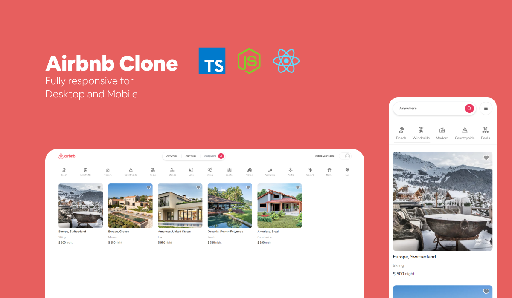

# Airbnb Clone



## Table of Contents
1. [Introduction](#introduction)
2. [Technologies](#technologies)
3. [Features](#features)
4. [Setup](#setup)
5. [Acknowledgement](#acknowledgement)

## Introduction

Welcome to my Airbnb Clone project! This project is a functional clone of the popular travel website, Airbnb, built to showcase my frontend development skills and my ability to learn and adapt to new technologies.

I chose Airbnb because of its appealing design and complex functionality. Recreating it was both challenging and fun, and gave me the opportunity to push my coding abilities further.

**This project has been deployed on Vercel and can be accessed [here](https://rent-website-clone-arantes.vercel.app).**

## Technologies

This project was developed using the following technologies:
- **ReactJS**: A JavaScript library for building user interfaces
- **Next.js 13**: A framework for building server-side rendering and static web applications using React
- **Tailwind CSS**: A utility-first CSS framework packed with classes like flex, pt-4, text-center for building responsive interfaces.
- **Vercel**: Platform for static sites and Serverless Functions 

## Features

This clone replicates many of Airbnb's features including:

- Home page with multiple sections
- Search functionality
- Detailed property page 
- User authentication 
- And much more!

## Setup

To run this project locally, clone the repository and install the dependencies:

```bash
git clone https://github.com/arantesjoao/airbnb-clone.git
cd airbnb-clone
npm install
```

Once the dependencies are installed, you can start the development server:

```bash
npm run dev
```

Then grab the necessary API keys and add them to your .env file and open http://localhost:3000 with your browser to see the result.


## Acknowledgement
I want to express my gratitude to [Code With Antonio](https://www.youtube.com/@codewithantonio) on YouTube, who provided a detailed tutorial that helped me a lot on the development of this project. I learned a lot from this tutorial and it has helped me build this to what it is now.

This project is part of my portfolio. If you have any questions or would like to discuss the project further, or work with me, please feel free to contact me!

João Víctor Arantes

[LinkedIn](https://www.linkedin.com/in/joaovictorarantes/)

[Email](mailto:arantesjoaov@gmail.com)

Enjoy exploring the project! 😊
